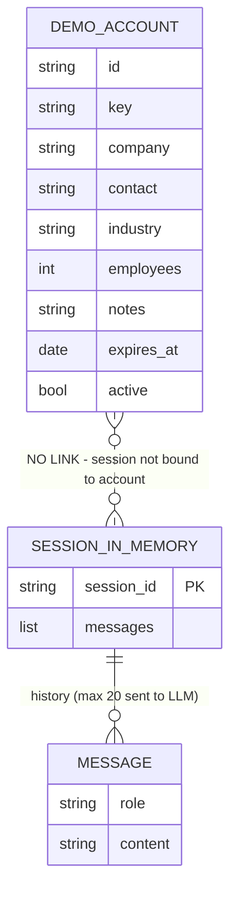
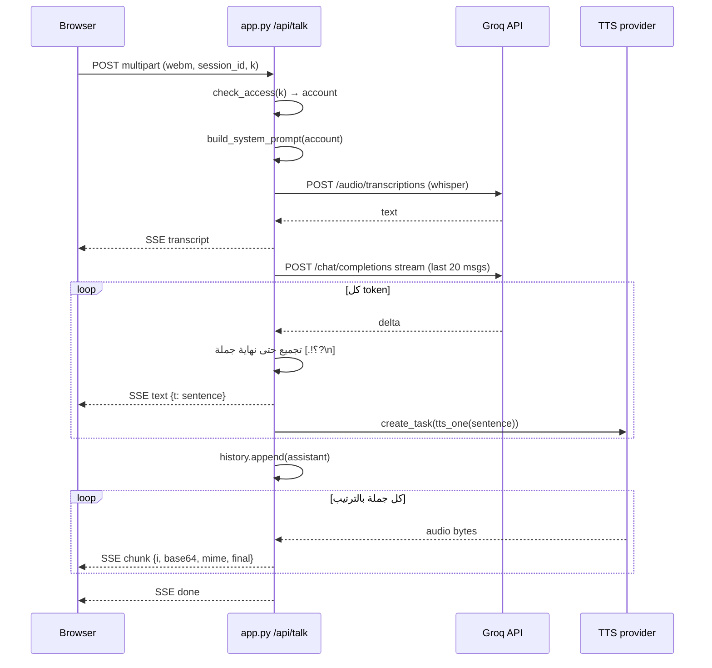
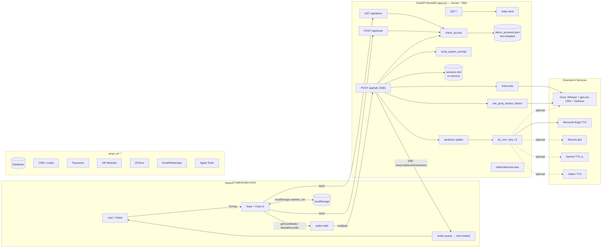
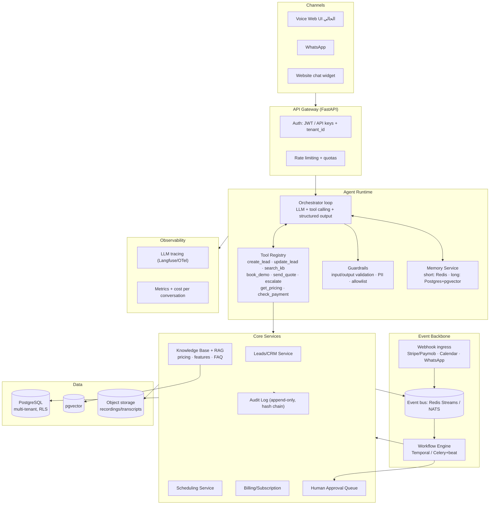

# SYSTEM_ARCHITECTURE_AUDIT.md
## Full System Audit & Architecture Discovery — `basemazab/nidham-nadeem`

| | |
|---|---|
| **تاريخ الفحص** | 2026-09-07 |
| **الفرع المفحوص** | `claude/hr-system-architecture-audit-th11xf` (مطابق تمامًا لـ `origin/main` عند commit `cac428f`) |
| **نوع الفحص** | قراءة فعلية لكل ملف في الريبو (100% من الكود) + تاريخ git + التبعيات + **تشغيل فعلي للتطبيق في بيئة معزولة** (Appendix A). لم يُعدَّل أو يُحذف أي ملف. |
| **حجم الكود** | 9 ملفات مُتتبَّعة — `app.py` (487 سطر) + `static/index.html` (313 سطر) + ملفات تهيئة/توثيق |

> **تنبيه أساسي يحكم التقرير كله:**
> الطلب كان فحص "نظام HR/ERP" بكل وحداته (Payroll, Attendance, ZKTeco, CRM, Payments…). الريبو الفعلي **لا يحتوي على أي من ذلك**. المشروع هو **مساعد مبيعات صوتي (Voice Sales Assistant)** يعمل كـ Demo يروّج لمنتج اسمه "نِظام HR" — والمنتج نفسه (لو كان موجودًا) يعيش في مستودع/نظام آخر غير متاح هنا. كل ما يقوله الـSystem Prompt عن Payroll وZKTeco وMobile App وAI Agent هو **نص تسويقي داخل البرومبت**، وليس كودًا.
> لذلك كثير من الأقسام أدناه ستكون 🔴 NOT IMPLEMENTED — وهذا استنتاج مُثبَت بالفحص، لا افتراض.

### مفتاح التصنيف
- ✅ FULLY IMPLEMENTED
- 🟡 PARTIALLY IMPLEMENTED
- 🔴 NOT IMPLEMENTED
- ⚠️ PRESENT BUT NOT FUNCTIONAL / BROKEN
- ❓ UNCERTAIN

---

## 1. Executive Summary

**ما هو النظام؟**
تطبيق ويب صغير (Python/FastAPI + صفحة HTML واحدة) اسمه "نِظام Assistant" (الاسم الكودي الداخلي: *Nadeem* — يظهر في اسم الريبو، ورسائل الـcommits، ومفتاح `localStorage`). يتيح لزائر أن **يتكلم بصوته** مع مساعد ذكي يرد **بالصوت** بالعامية المصرية، بهدف تأهيل العميل وتشجيعه على حجز Demo لمنتج "نِظام HR".

**الهدف منه:**
أداة عرض (Sales Demo) يستخدمها مالك الشركة (HR BASEM AZAB حسب البرومبت) في اجتماعات مع عملاء محتملين. كل عميل له رابط خاص `/?k=<key>` يجعل المساعد يخاطب العميل باسم شركته.

**ما الذي يستطيع فعله حاليًا (مُتحقَّق منه):**
1. تسجيل صوت المستخدم من المتصفح (MediaRecorder → webm).
2. تحويل الصوت إلى نص عبر Groq Whisper.
3. توليد رد نصي عبر Groq LLM (`openai/gpt-oss-120b`) ببرومبت مبيعات ثابت.
4. تقسيم الرد إلى جُمل وتحويل كل جملة إلى صوت (TTS) بالتوازي، وبثّها للمتصفح عبر SSE.
5. الاحتفاظ بتاريخ المحادثة **في الذاكرة فقط** (آخر 20 رسالة) لكل session.
6. بوابة دخول بمفتاح مشترك (`ACCESS_KEY`) أو مفاتيح Demo لكل عميل من ملف JSON مع تاريخ انتهاء.
7. زر "ابدأ من جديد" يمسح المحادثة.

**ما لا يستطيع فعله:** أي شيء خارج المحادثة. لا يحفظ Leads، لا يرسل رسائل، لا يحجز مواعيد، لا يصل لأي بيانات نظام، لا يملك Tools/Function calling.

**أهم مكوناته:** `app.py` (كل الـbackend)، `static/index.html` (كل الـfrontend)، `demo_accounts.json` (بيانات العملاء)، `Dockerfile`.

**النمط المعماري:** **Monolith** أحادي الملف (Single-file monolith)، Stateless من ناحية التخزين الدائم، Stateful في الذاكرة (session dict). لا Microservices ولا Workers.

**التقنيات:** Python 3.11، FastAPI، Uvicorn، Requests، edge-tts، Vanilla JS، Server-Sent Events، Docker. مزودو AI: Groq (STT+LLM+TTS اختياري)، Microsoft Edge TTS (افتراضي)، ElevenLabs/Gemini/Hakim (اختياريون).

---

## 2. Complete Technology Stack

| الفئة | التقنية | الإصدار | أين تُستخدم | الملفات | الحالة |
|---|---|---|---|---|---|
| **Backend framework** | FastAPI | `>=0.111` غير مثبَّت الإصدار؛ يحلّ حاليًا إلى **0.141.1** (Starlette 1.6.0, Pydantic 2.13.5) | كل الـAPI | `app.py:205` | ✅ |
| **ASGI server** | Uvicorn `[standard]` | `>=0.30` → يحلّ إلى **0.52.4** | تشغيل التطبيق | `Dockerfile:8`, `app.py:487` | ✅ |
| **Programming language (backend)** | Python | 3.11 (`python:3.11-slim`) | كل الـbackend | `Dockerfile:1` | ✅ |
| **Programming language (frontend)** | HTML5 + CSS3 + Vanilla JavaScript (ES2020) | — | صفحة واحدة | `static/index.html` | ✅ |
| **Frontend framework** | لا يوجد (Vanilla) | — | — | — | 🔴 لا framework |
| **HTTP client** | requests | `>=2.31` → **2.34.2** | استدعاء Groq/ElevenLabs/Gemini/Hakim | `app.py:213-327` | ✅ |
| **Form parsing** | python-multipart | `>=0.0.9` → **0.0.32** | `Form`/`File` في `/api/talk`, `/api/reset` | `app.py:16,383,393` | ✅ |
| **Env config** | python-dotenv | `>=1.0` → **1.2.3** | `load_dotenv()` | `app.py:15,20` | ✅ |
| **TTS (default)** | edge-tts (Microsoft Edge Neural TTS) | `>=6.1` → **7.2.8** | `tts_edge` — صوت `ar-EG-SalmaNeural` | `app.py:255-261` | ✅ |
| **STT** | Groq Whisper `whisper-large-v3-turbo` | API | `transcribe()` | `app.py:213-225` | ✅ |
| **LLM** | Groq `openai/gpt-oss-120b` | API, streaming | `ask_groq_stream_tokens()` | `app.py:228-252` | ✅ |
| **TTS (optional)** | Groq Orpheus `canopylabs/orpheus-arabic-saudi` | API | `tts_orpheus()` | `app.py:264-272` | 🟡 كود موجود، غير مفعّل افتراضيًا |
| **TTS (optional)** | ElevenLabs `eleven_multilingual_v2` | API | `tts_elevenlabs()` | `app.py:275-287` | 🟡 كود موجود، غير مفعّل |
| **TTS (optional)** | Google Gemini `gemini-2.5-flash-preview-tts` | API | `tts_gemini()` | `app.py:290-308` | ⚠️ **مكسور** (انظر §21) |
| **TTS (optional)** | Hakim `hakim-flash-v1` (tryhakim.ai) | API | `tts_hakim()` | `app.py:311-327` | 🟡 كود موجود، غير مفعّل |
| **Audio libs** | miniaudio `>=1.59` → 1.71, numpy `>=2.1` → 2.4.6 | — | **غير مستوردة في أي مكان** | `requirements.txt:6-7` | ⚠️ Dead dependency |
| **Database** | لا يوجد | — | — | — | 🔴 |
| **ORM / Migrations** | لا يوجد | — | — | — | 🔴 |
| **Authentication** | مفتاح مشترك/مفاتيح Demo عبر query/form param `k` | — | كل endpoints تحت `/api` | `app.py:153-163` | 🟡 (Access gate، ليس Auth حقيقي) |
| **Session store** | Python dict في الذاكرة | — | تاريخ المحادثة | `app.py:203,415` | 🟡 |
| **Config store** | JSON file (`demo_accounts.json`) يُعاد تحميله عند تغير mtime | — | حسابات Demo | `app.py:95-117` | ✅ |
| **APIs** | REST + SSE (Server-Sent Events) | — | `/api/talk` يبث SSE | `app.py:209,483` | ✅ |
| **AI Agents / Tools / Function calling** | لا يوجد | — | — | — | 🔴 |
| **Vector DB / Embeddings / RAG** | لا يوجد | — | — | — | 🔴 |
| **Cache** | لا يوجد (سوى cache ملف JSON في الذاكرة) | — | — | `app.py:95` | 🔴 |
| **Queue / Workers / Cron** | لا يوجد | — | — | — | 🔴 |
| **Storage (files)** | نظام ملفات محلي فقط (`static/`) | — | `welcome.wav`, `index.html` | `app.py:206` | 🟡 |
| **Hosting** | Docker، منفذ 7860 (اصطلاح Hugging Face Spaces) | — | — | `Dockerfile:6-8`, `DEMO.md` يذكر "الـ Space" | ❓ مستنتج: HF Spaces |
| **Deployment** | يدوي: git push (رسائل commit "deploy nadeem voice agent" ×20) | — | — | git log | 🟡 |
| **CI/CD** | لا يوجد (لا `.github/`) | — | — | — | 🔴 |
| **Tests** | لا يوجد | — | — | — | 🔴 |
| **Monitoring** | لا يوجد | — | — | — | 🔴 |
| **Logging** | `print()` إلى stdout فقط | — | توقيت الرد، أخطاء ملف الديمو | `app.py:112,136,478` | 🟡 |
| **Fonts (CDN)** | Google Fonts — Tajawal | — | الواجهة | `static/index.html:7` | ✅ |
| **Browser APIs** | MediaRecorder, getUserMedia, fetch streaming, localStorage, crypto.randomUUID, Audio | — | الواجهة | `static/index.html:87-88,148,281-293` | ✅ |

---

## 3. Complete Project Structure

```
nidham-nadeem/
├── app.py                 # كل الـBackend: config, auth gate, AI pipeline, 4 endpoints (487 سطر)
├── static/
│   ├── index.html         # كل الـFrontend: CSS + HTML + JS (313 سطر) — صفحة واحدة
│   └── welcome.wav        # صوت ترحيب مسجّل مسبقًا (PCM 16-bit mono 24kHz, 430KB) يُشغَّل عند بدء الجلسة
├── demo_accounts.json     # حسابات Demo لكل عميل (key, company, contact, employees, expires_at, active)
├── DEMO.md                # دليل تشغيل الديمو للمالك (بالعربية)
├── .env.example           # قالب متغيرات البيئة
├── .gitignore             # .env, *.wav, *.mp3, __pycache__/
├── Dockerfile             # python:3.11-slim → uvicorn على 7860
└── requirements.txt       # 8 تبعيات
```

| المجال المطلوب | هل موجود؟ | التفاصيل |
|---|---|---|
| Frontend | ✅ | `static/index.html` فقط |
| Backend | ✅ | `app.py` فقط |
| API | ✅ | داخل `app.py` (4 routes) |
| Mobile | 🔴 | لا يوجد. (البرومبت يدّعي "تطبيق موبايل" — ليس في هذا الريبو) |
| Desktop | 🔴 | لا يوجد |
| Database | 🔴 | لا يوجد schema/migrations/ORM |
| Services | 🟡 | دوال داخل `app.py` (transcribe, tts_*, check_access) — لا طبقة services منفصلة |
| Workers | 🔴 | لا يوجد |
| AI | ✅ | داخل `app.py` (STT/LLM/TTS) |
| Authentication | 🟡 | Access gate بمفتاح — داخل `app.py:98-163` |
| Integrations | 🟡 | HTTP calls مباشرة لمزودي AI فقط |
| Device integrations (ZKTeco…) | 🔴 | لا يوجد |
| Scripts | 🔴 | لا يوجد |
| Tests | 🔴 | لا يوجد |
| Documentation | 🟡 | `DEMO.md` (تشغيلي فقط)، لا README تقني |
| Deployment | 🟡 | `Dockerfile` فقط |

**ملاحظة على `.gitignore`:** يتجاهل `*.wav` لكن `static/welcome.wav` مُتتبَّع في git (أُضيف بالقوة في commit `77d413d`). تناقض صغير يعني أن أي تعديل مستقبلي على الملف لن يُلتقط بـ `git add .` تلقائيًا.

---

## 4. Database Architecture

**الحالة: 🔴 NOT IMPLEMENTED — لا توجد قاعدة بيانات إطلاقًا.**

تم التحقق من:
- لا استيراد لأي driver/ORM (`sqlalchemy`, `psycopg`, `sqlite3`, `supabase`, `pymongo`…) في `app.py`.
- لا مجلد `migrations/`، لا ملفات `.sql`، لا `schema`.
- `requirements.txt` لا يحتوي أي تبعية DB.

**ما يقوم مقام التخزين حاليًا:**

| "المخزن" | النوع | المحتوى | الديمومة | الملف |
|---|---|---|---|---|
| `sessions` | `dict[str, list[dict]]` في ذاكرة العملية | تاريخ المحادثة `{role, content}` لكل `session_id` | تُفقد عند إعادة التشغيل؛ لا حد أقصى؛ لا TTL | `app.py:203` |
| `_demo_cache` | dict في الذاكرة | نسخة من `demo_accounts.json` + mtime | تُعاد قراءتها عند تغير الملف | `app.py:95-117` |
| `demo_accounts.json` | ملف JSON على القرص | حسابات الديمو | دائم (في الريبو) | `demo_accounts.json` |
| `localStorage['nadeem_sid']` | متصفح العميل | UUID الجلسة | دائم في المتصفح | `static/index.html:87-88` |

**"Schema" الفعلي لحساب الديمو** (من `demo_accounts.json` + قراءته في `app.py:120-196`):

| الحقل | النوع | الاستخدام |
|---|---|---|
| `id` | string | معرّف قابل للقراءة (غير مستخدم في الكود فعليًا) |
| `key` | string أو `"env:VAR"` | كود الدخول — `account_key()` `app.py:120` |
| `company`, `contact`, `industry`, `notes` | string | تُحقن في البرومبت — `build_demo_context()` `app.py:166` |
| `employees` | int/null | تُحقن في البرومبت لترشيح الباقة |
| `expires_at` | ISO date أو "" | `account_expired()` `app.py:128` |
| `active` | bool (افتراضي true) | `resolve_account()` `app.py:145` |

Tables / PK / FK / Indexes / RLS / Views / Functions / Triggers / Stored procedures / Migrations: **لا شيء منها موجود.**



> ملاحظة معمارية مهمة: الجلسة **غير مربوطة** بحساب الديمو. الربط يحدث لحظيًا في كل طلب عبر `k`، بينما `sessions` مفتاحه `session_id` فقط (`app.py:415`).

---

## 5. Backend Architecture

### 5.1 Routes / Endpoints (كاملة — 4 routes + static mount)

| # | Method | Endpoint | الوظيفة | Auth | يستقبل | يرجع | الملف |
|---|---|---|---|---|---|---|---|
| 1 | GET | `/` | يخدم `static/index.html` | لا | — | HTML | `app.py:359-361` |
| 2 | GET | `/api/demo?k=` | يتحقق من مفتاح الدخول ويرجع بيانات حساب الديمو للواجهة | مفتاح `k` (query) | `k: str` | `{ok, demo, company, contact, employees, expires_at}` أو `403 {ok:false,error}` | `app.py:364-379` |
| 3 | POST | `/api/reset` | يمسح تاريخ جلسة | مفتاح `k` (form) | `session_id`, `k` (multipart form) | `{ok:true}` أو `403` | `app.py:382-389` |
| 4 | POST | `/api/talk` | الـpipeline الكامل: صوت → نص → LLM → TTS، يبث النتائج | مفتاح `k` (form) | `file` (audio/webm), `session_id`, `k` | **SSE stream** `text/event-stream` بأحداث: `transcript`, `text`, `chunk`, `error`, `done` | `app.py:392-483` |
| 5 | GET | `/static/*` | ملفات ثابتة | لا | — | file | `app.py:206` |

**تفصيل أحداث SSE في `/api/talk`** (`app.py:404-481`):

| الحدث | البيانات | متى |
|---|---|---|
| `transcript` | `{text}` | بعد نجاح STT |
| `text` | `{t}` | لكل جملة مكتملة من بث الـLLM |
| `chunk` | `{i, audio(base64), mime, final}` | لكل جملة بعد اكتمال TTS الخاص بها، بالترتيب |
| `error` | `{message}` | STT فارغ/فشل، LLM فشل/فارغ، TTS فشل |
| `done` | `{}` | نهاية البث |

### 5.2 Controllers / Services / Business logic

لا يوجد فصل طبقات. الدوال داخل `app.py`:

| الدالة | الدور | السطر |
|---|---|---|
| `load_demo_accounts()` | قراءة/تحديث cache ملف الحسابات بناءً على mtime؛ عند JSON تالف يُبقي آخر نسخة سليمة | 98 |
| `account_key()` | حل `env:VAR` إلى قيمة من البيئة | 120 |
| `account_expired()` | مقارنة `expires_at` بتاريخ اليوم؛ تاريخ غير مفهوم = غير منتهٍ | 128 |
| `resolve_account()` | يبحث عن حساب نشط بمفتاح مطابق | 140 |
| `check_access()` | منطق البوابة: حساب ديمو صالح → مسموح؛ منتهٍ → 403 EXPIRED؛ وإلا إن `ACCESS_KEY` مضبوط ولم يطابق → 403 BAD_KEY؛ وإلا مسموح بلا حساب | 153 |
| `build_demo_context()` | يولّد كتلة سياق تُلحق بالبرومبت | 166 |
| `build_system_prompt()` | `SYSTEM_PROMPT + context` | 199 |
| `sse()` | تنسيق حدث SSE | 209 |
| `transcribe()` | Groq Whisper (لغة عربية مُثبتة) | 213 |
| `ask_groq_stream_tokens()` | بث tokens من Groq؛ `temperature 0.6`, `max_tokens 250`, آخر 20 رسالة | 228 |
| `tts_edge/orpheus/elevenlabs/gemini/hakim()` | مزودو TTS | 255-327 |
| `tts_one()` | اختيار المحرك + 3 محاولات مع backoff (0.5s, 1s, 1.5s) | 330 |
| `pcm_to_wav()` | تغليف PCM في WAV — **غير مستدعاة أبدًا** | 349 |

### 5.3 Background jobs / Webhooks / Middleware / Error handling

| العنصر | الحالة | ملاحظة |
|---|---|---|
| Background jobs | 🔴 | لا يوجد. TTS يجري بـ `asyncio.create_task` داخل نفس الطلب (`app.py:425`) — ليس background job حقيقيًا |
| Webhooks (incoming/outgoing) | 🔴 | لا يوجد |
| Authentication middleware | 🔴 | لا middleware؛ `check_access()` تُستدعى يدويًا داخل كل endpoint |
| Authorization / Roles | 🔴 | لا يوجد مفهوم أدوار |
| CORS | لا إعداد (افتراضي FastAPI = same-origin فقط) | مناسب لأن الواجهة تُخدم من نفس الأصل |
| Error handling | 🟡 | try/except داخل `event_stream` يرسل `error` SSE بنص الاستثناء الخام؛ لا exception handlers عامة؛ لا request validation مخصص |
| Rate limiting | 🔴 | لا يوجد |
| Input validation | 🟡 | فقط: حجم الصوت `< 1000 bytes` → 400 (`app.py:401`) |

---

## 6. Frontend Architecture

**صفحة واحدة** (`static/index.html`) بلا router، بلا framework، بلا build step.

### 6.1 الشاشات / الحالات

| الشاشة | العناصر | ماذا يفعل المستخدم | الكود |
|---|---|---|---|
| **Gate (شاشة البداية)** | عنوان، شارة "🎯 ديمو خاص بـ {company}" (إن وُجد حساب)، رسالة خطأ حمراء (إن كان المفتاح غلط/منتهٍ)، زر "🎙️ ابدأ الكلام" | يضغط ابدأ → يُشغَّل `welcome.wav`، تُزال البوابة، يُفعَّل المايك. لو الحساب Demo يُولَّد `session_id` جديد | `index.html:57-63, 94-118, 164-174` |
| **Chat** | Header + شارة "ديمو {company}"، منطقة رسائل (bot/user bubbles)، زر مايك دائري، سطر حالة، زر "🔄 ابدأ من جديد" | يضغط المايك للتسجيل، يضغط ثانية للإرسال؛ يرى النص المكتوب لكلامه ثم رد المساعد يتكوّن جملة بجملة مع تشغيل الصوت | `index.html:65-75, 194-310` |

### 6.2 State management (متغيرات عامة في JS)

`sid` (localStorage)، `urlK` (من `?k=`)، `demo`, `gateBlocked`, `mediaRecorder`, `chunks`, `recording`, `busy`, `audioQueue`, `playing`, `currentPlayer`, `queueDone`. لا store، لا reactive framework.

### 6.3 API client

`fetch` مباشر:
- `GET /api/demo?k=` عند التحميل (`loadDemo()` سطر 94).
- `POST /api/reset` (multipart) عند الضغط على إعادة (سطر 176).
- `POST /api/talk` (multipart) + قارئ SSE يدوي عبر `res.body.getReader()` (سطر 213-265).

### 6.4 Audio pipeline في المتصفح

`getUserMedia` (echoCancellation/noiseSuppression/autoGain) → `MediaRecorder` → Blob `audio/webm` (يُرفض < 2000 bytes) → إرسال. الاستقبال: كل `chunk` base64 → `Uint8Array` → Blob → `new Audio(objectURL)` في طابور تسلسلي `pump()`.

### 6.5 Authentication flow (frontend)

المفتاح يُقرأ من الـURL ويُرسل مع كل طلب. لا تخزين للمفتاح، لا cookies، لا tokens.

### 6.6 Navigation / Permissions

لا navigation (صفحة واحدة). لا permissions في الواجهة سوى تعطيل زر البداية عند رفض المفتاح.

### 6.7 XSS

آمن: كل النصوص تُضاف بـ `textContent` (سطر 125, 250). الاستخدام الوحيد لـ `innerHTML` (سطر 133, 190) بمحتوى ثابت.

### 6.8 ملاحظات توافق

- Object URLs من `URL.createObjectURL` لا تُحرَّر (`revokeObjectURL`) → تسرب ذاكرة بسيط في الجلسات الطويلة (سطر 148).
- ❓ iOS Safari: `MediaRecorder` قد ينتج `audio/mp4` لا `webm`؛ الكود يُسمّي الملف `speech.webm` دائمًا (`index.html:201`, `app.py:218`). قد يعمل لأن Whisper يتعرف على الصيغة من المحتوى، لكن لم يُختبر.

---

## 7. HR Modules

**كل الوحدات: 🔴 NOT IMPLEMENTED في هذا الريبو.**

| Module | موجود؟ | في الكود؟ | Tables | APIs | Pages | ماذا يستطيع المستخدم فعله |
|---|---|---|---|---|---|---|
| Employee Management | 🔴 | لا | — | — | — | لا شيء |
| Personnel | 🔴 | لا | — | — | — | لا شيء |
| Attendance | 🔴 | لا | — | — | — | لا شيء |
| Shifts | 🔴 | لا | — | — | — | لا شيء |
| Leave Management | 🔴 | لا | — | — | — | لا شيء |
| Payroll | 🔴 | لا | — | — | — | لا شيء |
| Overtime / Deductions / Bonuses / Penalties | 🔴 | لا | — | — | — | لا شيء |
| Social Insurance | 🔴 | لا | — | — | — | لا شيء |
| Taxes | 🔴 | لا | — | — | — | لا شيء |
| Recruitment / CV Screening | 🔴 | لا | — | — | — | لا شيء |
| Performance / KPIs | 🔴 | لا | — | — | — | لا شيء |
| Training | 🔴 | لا | — | — | — | لا شيء |
| Documents | 🔴 | لا | — | — | — | لا شيء |
| Employee Self-Service / Mobile | 🔴 | لا | — | — | — | لا شيء |
| Reports | 🔴 | لا | — | — | — | لا شيء |
| CRM | 🔴 | لا | — | — | — | لا شيء |

**الشيء الوحيد "HR-related" في الريبو** هو *المعرفة النصية* داخل `SYSTEM_PROMPT` (`app.py:42-90`) التي تصف هذه الوحدات كميزات منتج، مع أسعار وحُجج بيع. هذه المعرفة:
- ثابتة (hardcoded) وتتطلب إعادة نشر لتغييرها.
- تذكر قوانين ("قانون العمل 14/2025"، "تأمينات 148/2019"، "شرائح 2026") وأسماء عملاء ومنافسين — لم يُتحقق منها ولا يمكن التحقق منها من الكود.
- **ملاحظة تاريخية:** النسخة الأولى من البرومبت (commit `4fe4c3c`) كانت تذكر "قانون 12 لسنة 2003" وتمنع ذكر أسعار؛ النسخة الحالية تذكر قانون 14/2025 وأسعارًا كاملة. أي تناقض بين النسختين يُحسم بالنسخة الحالية فقط.

---

## 8. Biometric / ZKTeco Integration

**الحالة: 🔴 NOT IMPLEMENTED.**

تم البحث عن: `zk`, `zkteco`, `adms`, `iclock`, `push`, `punch`, `biometric`, `device`, `socket`, `udp`, `tcp` في كل الملفات — لا نتائج في الكود. الذكر الوحيد:

- `app.py:60`: نص داخل البرومبت: *"ربط ZKTeco لحظي بالسحاب (بروتوكول ADMS)"* — ادعاء تسويقي يقوله المساعد للعميل.

| البند | النتيجة |
|---|---|
| Integration موجود؟ | 🔴 لا |
| الأجهزة المدعومة / البروتوكول / IP/SDK | — |
| Device ingestion / Attendance sync / Polling vs real-time | — |
| Duplicate punches / ربط الموظف بالجهاز / تخزين punches / تحويلها لحضور | — |
| الملفات المسؤولة | لا يوجد |

---

## 9. AI Architecture

### 9.1 المكونات الموجودة

| العنصر | الحالة | التفاصيل | الملف |
|---|---|---|---|
| **AI Providers** | ✅ | Groq (STT + LLM + Orpheus TTS)، Microsoft Edge TTS، ElevenLabs، Google Gemini (TTS فقط)، Hakim | `app.py:22-38` |
| **Models** | ✅ | STT: `whisper-large-v3-turbo`; LLM: `openai/gpt-oss-120b`; TTS: `ar-EG-SalmaNeural` (افتراضي) / `canopylabs/orpheus-arabic-saudi` / `eleven_multilingual_v2` / `gemini-2.5-flash-preview-tts` (voice Kore) / `hakim-flash-v1` (voice yusuf-egyptian) | `app.py:23-36` |
| **API keys config** | ✅ | كلها من env عبر dotenv: `GROQ_API_KEY`, `ELEVENLABS_API_KEY`, `GEMINI_API_KEY`, `HAKIM_API_KEY`. لا مفاتيح مضمّنة في الكود (تم المسح). `ELEVENLABS_VOICE_ID` له قيمة افتراضية عامة `pNInz6obpgDQGcFmaJgB` (voice id عام لـ ElevenLabs "Adam"، ليس سرًا) | `app.py:22-40`, `.env.example` |
| **Prompt** | ✅ | System prompt واحد ثابت (~50 سطر) + سياق ديمو ديناميكي | `app.py:42-90, 166-200` |
| **AI Agent (autonomous loop)** | 🔴 | لا يوجد. مجرد استدعاء chat completion واحد لكل رسالة | — |
| **Tools / Function calling** | 🔴 | لا `tools`/`functions` في طلب Groq (`app.py:233-240`) | — |
| **Memory** | 🟡 | قصيرة الأمد فقط: آخر 20 رسالة في dict بالذاكرة؛ لا memory طويلة الأمد، لا تلخيص | `app.py:229,415` |
| **RAG / Embeddings / Vector DB / Knowledge base** | 🔴 | لا يوجد. "المعرفة" = نص البرومبت | — |
| **AI workflows / orchestration** | 🔴 | لا يوجد (لا LangChain/LangGraph/CrewAI…) | — |
| **Autonomous actions** | 🔴 | لا يوجد | — |
| **Guardrails** | 🟡 | نصية فقط داخل البرومبت ("متكدبش"، "حوّل لباسم"، "ارجع لمهمتك" عند محاولة jailbreak). لا موderation، لا output validation، لا intent classifier | `app.py:79-87` |
| **Conversation history** | 🟡 | في الذاكرة، تُفقد عند restart، غير مُصدَّرة، لا تسجيل | `app.py:203` |
| **Observability / tracing للـAI** | 🔴 | `print` واحد بالتوقيت فقط (`app.py:478`) | — |

### 9.2 Pipeline الفعلي لكل رسالة (`/api/talk`)



### 9.3 Sales funnel: ما الموجود وما الناقص

| المرحلة | الحالة | الدليل |
|---|---|---|
| **Visitor** يفتح الرابط | ✅ | `GET /` + `?k=` |
| **Chat** (صوتي) | ✅ | `/api/talk` + SSE |
| **AI** يرد | ✅ | Groq LLM + TTS |
| **Intent detection** | 🟡 ضمني فقط | لا classifier ولا structured output؛ الـLLM "يفهم" النية داخل النص الحر. لا يُستخرج intent كبيانات |
| **Lead** (اسم/شركة/عدد موظفين/رقم) | ⚠️ يُطلب صوتيًا ولا يُحفظ | البرومبت يطلبها (`app.py:47,85,89`) لكن **لا يوجد أي كود يستخرجها أو يخزنها**. تبقى داخل `sessions` في الذاكرة وتضيع |
| **CRM** | 🔴 | لا يوجد |
| **Follow-up** | 🔴 | لا رسائل، لا مهام، لا تذكير |
| **Demo booking** | 🔴 | لا تقويم، لا API حجز؛ المساعد "يعِد" فقط بالكلام |
| **Pricing** | 🟡 | أسعار ثابتة في البرومبت؛ لا عرض سعر مُولَّد ولا PDF |
| **Payment** | 🔴 | لا يوجد |
| **Onboarding / Activation** | 🔴 | لا يوجد |

---

## 10. AI Sales Agent Deep Audit

### 10.1 القدرات الفعلية

| السؤال | الإجابة | الدليل |
|---|---|---|
| ماذا يستطيع؟ | محادثة صوتية عربية مصرية مقيدة ببرومبت مبيعات؛ يعرف الأسعار والميزات المكتوبة له؛ يخاطب العميل باسم شركته إن كان الرابط مخصصًا؛ يتذكر آخر 20 رسالة | `app.py:42-90,166-200,229` |
| ماذا لا يستطيع؟ | أي فعل خارج توليد النص/الصوت | لا tools |
| إنشاء Lead؟ | 🔴 لا | لا تخزين، لا endpoint |
| تعديل Lead؟ | 🔴 لا | — |
| قراءة بيانات النظام؟ | 🔴 لا (لا نظام) | فقط بيانات حساب الديمو المحقونة في البرومبت |
| البحث؟ | 🔴 لا | — |
| استخدام APIs؟ | 🔴 لا | لا function calling |
| إرسال رسائل (Email/WhatsApp/SMS)؟ | 🔴 لا | — |
| إرسال عروض أسعار؟ | 🔴 لا (يذكرها شفهيًا فقط) | — |
| حجز Demo؟ | 🔴 لا (يقول إنه سيُحجز) | — |
| متابعة العميل؟ | 🔴 لا | — |
| معرفة أن العميل دفع؟ | 🔴 لا | — |
| تشغيل onboarding؟ | 🔴 لا | — |
| اتخاذ إجراءات بدون تدخل بشري؟ | 🔴 لا | صفر إجراءات ممكنة أصلًا |

### 10.2 Tools المتاحة للـAI

**لا يوجد أي Tool.** طلب الـLLM (`app.py:233-240`) يحتوي فقط `model, messages, temperature, max_tokens, stream`. لا `tools`, لا `tool_choice`, لا `response_format`.

| Tool | الوظيفة | Input | Output | API/File | يستدعيه الـAI فعليًا؟ |
|---|---|---|---|---|---|
| — | — | — | — | — | 🔴 لا يوجد أي tool |

### 10.3 مخاطر سلوكية في البرومبت (ليست أعطالًا برمجية لكنها مهمة)

1. **إنكار كونه AI:** القاعدة 4 (`app.py:83`) "ممنوع تقول إنك Gemini أو AI أو بوت" — بينما الواجهة نفسها تصفه بـ"المساعد الذكي". تعارض داخلي + خطر قانوني/سمعة (شفافية المستخدم).
2. **ادعاءات غير قابلة للتحقق:** أسماء عملاء حقيقيين، ومقارنات أسعار بمنافسين (Bayzat, ZenHR) داخل البرومبت (`app.py:64,77`). لو تغيرت الأسعار يصبح المساعد يكذب رغم القاعدة 1.
3. **قوانين محددة بأرقام** (14/2025، 148/2019) — أي خطأ فيها ينتقل مباشرة للعميل.
4. **الترحيب الصوتي ثابت** (`welcome.wav`) فلا يتطابق بالضرورة مع "الافتتاحية" المكتوبة في البرومبت (`app.py:90`)؛ قد يعيد المساعد تقديم نفسه بعد الترحيب.
5. **حد 20 رسالة** يعني أن بيانات Lead المذكورة في بداية مكالمة طويلة **تُنسى** قبل نهايتها.

---

## 11. Authentication & Authorization

| البند | الحالة | التفاصيل |
|---|---|---|
| Login / Registration | 🔴 | لا يوجد حسابات مستخدمين |
| Roles (Admin/HR/Employee/Manager/Super Admin) | 🔴 | لا يوجد |
| Permissions | 🔴 | لا يوجد |
| JWT / Session cookies | 🔴 | لا يوجد |
| RLS | 🔴 | لا DB |
| **Access gate** | 🟡 | مفتاح واحد مشترك (`ACCESS_KEY`) أو مفتاح Demo لكل عميل، يُمرَّر كـ `k` في query string (`/api/demo`) أو form field (`/api/talk`, `/api/reset`) |

**منطق `check_access` بالتفصيل (`app.py:153-163`):**
1. إذا `k` يطابق حساب ديمو نشط → إن كان منتهيًا 403 EXPIRED، وإلا مسموح مع الحساب.
2. وإلا إذا `ACCESS_KEY` مضبوط و`k != ACCESS_KEY` → 403 BAD_KEY.
3. وإلا (أي `ACCESS_KEY` فارغ، **أو** `k == ACCESS_KEY`) → مسموح بلا حساب.

**مخاطر ومشاكل:**

| # | المشكلة | الخطورة | الموضع |
|---|---|---|---|
| A1 | **مفتوح افتراضيًا:** `ACCESS_KEY` فارغ في `.env.example` → أي شخص يعرف الرابط يستهلك رصيد Groq/TTS بلا حد | 🔴 عالية (مالية) | `app.py:39,161`, `.env.example:17` |
| A2 | مفتاح الديمو في **query string** (`?k=`) → يُسجَّل في server logs، browser history، Referer headers | 🟠 متوسطة | `index.html:96`, `app.py:365` |
| A3 | مفاتيح الديمو **plaintext في الريبو** (`mushkah-2026`) وفي git history للأبد | 🟠 متوسطة | `demo_accounts.json:7` |
| A4 | مقارنة المفتاح بـ `==` بدل `hmac.compare_digest` (timing side-channel نظري) | 🟢 منخفضة | `app.py:148,161` |
| A5 | لا rate limiting / brute-force protection على المفتاح | 🟠 متوسطة | كل endpoints |
| A6 | `session_id` يولّده العميل وأي شخص يعرفه يمكنه `/api/reset` أو إكمال محادثته؛ UUIDv4 عشوائي فيقلل الخطر | 🟢 منخفضة | `app.py:383,393` |
| A7 | لا ربط بين الجلسة والحساب: نفس `session_id` يمكن استخدامه بمفاتيح مختلفة | 🟢 منخفضة | `app.py:415` |
| A8 | لا HTTPS enforcement في التطبيق (يعتمد على المضيف؛ المايك يتطلب HTTPS أصلًا) | 🟢 | — |

---

## 12. Multi-Tenant Architecture

**الحالة: 🔴 ليس Multi-Tenant بالمعنى المعماري.**

- لا `company_id`/`tenant_id` في أي بيانات.
- لا عزل DB (لا DB).
- "العزل" الوحيد: **سياق البرومبت** يختلف حسب مفتاح الديمو (`build_demo_context`). وهو عزل عرض (presentation) لا عزل بيانات.
- الجلسات مشتركة في dict واحد؛ لا فصل بين عملاء الديمو سوى عشوائية `session_id`.
- الـSystem Prompt نفسه يحتوي القاعدة 5 "متحكيش بيانات عملاء آخرين" — أي أن عزل بيانات العملاء المحتملين معتمد على **التزام الـLLM** لا على الكود.

---

## 13. External Integrations

| Integration | ماذا يفعل | فعال حاليًا؟ | أين | الملف |
|---|---|---|---|---|
| **Groq API** (STT) | تحويل صوت → نص | ✅ (يتطلب `GROQ_API_KEY`) | `transcribe()` | `app.py:213` |
| **Groq API** (LLM) | توليد الرد | ✅ | `ask_groq_stream_tokens()` | `app.py:228` |
| **Groq API** (Orpheus TTS) | نص → صوت | 🟡 اختياري (`TTS_ENGINE=groq_orpheus`) | `tts_orpheus()` | `app.py:264` |
| **Microsoft Edge TTS** (مكتبة edge-tts، خدمة غير رسمية) | نص → صوت | ✅ افتراضي، بلا مفتاح | `tts_edge()` | `app.py:255` |
| **ElevenLabs** | TTS | 🟡 اختياري | `tts_elevenlabs()` | `app.py:275` |
| **Google Gemini** | TTS | ⚠️ مكسور (PCM بلا header) | `tts_gemini()` | `app.py:290` |
| **Hakim (tryhakim.ai)** | TTS عربي | 🟡 اختياري | `tts_hakim()` | `app.py:311` |
| **Google Fonts** | خط Tajawal | ✅ | `<link>` | `index.html:7` |
| Payment / WhatsApp / Email / SMS / Google Calendar / Microsoft / ZKTeco / Cloud storage / Analytics / CRM | — | 🔴 غير موجود | — | — |

**ملاحظة على edge-tts:** يعتمد على endpoint غير موثّق رسميًا من Microsoft؛ قد يتوقف بلا إنذار ولا SLA. وهو المحرك الافتراضي للإنتاج.

---

## 14. Payments & Subscription

**الحالة: 🔴 NOT IMPLEMENTED بالكامل.**

| البند | الحالة |
|---|---|
| Payment system / provider | 🔴 |
| Subscription plans | 🟡 **كنص فقط** في البرومبت (مجانية/Starter 750/Pro 2,500/Business 6,000/Enterprise) — `app.py:67-75` |
| Trial | 🟡 كنص فقط ("شهرين تجربة"، "Beta 3 شهور") |
| Billing / Webhooks / Payment confirmation / Activation / Expiration / Upgrade-Downgrade | 🔴 |

الشيء الوحيد المشابه لـ"اشتراك" هو **انتهاء صلاحية رابط الديمو** (`expires_at`) — وهو للديمو لا للدفع.

---

## 15. Reports & Analytics

**الحالة: 🔴 NOT IMPLEMENTED.**

لا تقارير، لا dashboards، لا analytics. الشيء الوحيد المقاس: سطر `print` بزمن أول صوت والرد الكامل وعدد الجمل (`app.py:478-480`) — يُكتب في stdout ولا يُخزَّن.

لا يُسجَّل: عدد المحادثات، النصوص، الـLeads، معدل التحويل، الأخطاء، التكلفة.

---

## 16. Notifications

| القناة | الحالة |
|---|---|
| Email | 🔴 |
| SMS | 🔴 |
| WhatsApp | 🔴 |
| Push | 🔴 |
| In-app | 🟡 فقط سطر الحالة `#status` في الواجهة (رسائل تشغيلية مثل "بفهمك…"، "⚠️ مشكلة في السمع") — `index.html:156` |

لا توجد آلية لإبلاغ المالك بأن عميلًا تحدث مع المساعد أو ترك بياناته.

---

## 17. Security Audit

| # | النوع | الوصف | الخطورة | الموضع |
|---|---|---|---|---|
| S1 | Hardcoded secrets | **لا مفاتيح API مضمّنة** (تم المسح بـ regex لـ `sk-`, `gsk_`, `api_key=`). ✅ | — | — |
| S2 | Secrets in repo | مفتاح ديمو العميل `mushkah-2026` نصًا صريحًا في الريبو + git history. الحل الموجود (`env:VAR`) غير مستخدم فعليًا | 🟠 متوسطة | `demo_accounts.json:7` |
| S3 | Open by default | `ACCESS_KEY` فارغ = الخدمة مفتوحة للعالم → استنزاف رصيد Groq/ElevenLabs/Hakim (كلها مدفوعة) | 🔴 عالية | `app.py:39,161` |
| S4 | No rate limiting | لا حد على `/api/talk` (كل طلب = STT + LLM + TTS مدفوع). DoS مالي سهل حتى بمفتاح صحيح مسرَّب | 🔴 عالية | `app.py:392` |
| S5 | Key in URL | المفتاح في query string → logs/history/referer | 🟠 متوسطة | `index.html:96` |
| S6 | Information disclosure | نص الاستثناء الخام يُرسل للعميل (`f"مشكلة في السمع: {e}"`) — قد يكشف URLs داخلية، أكواد HTTP، رسائل المزود | 🟡 منخفضة-متوسطة | `app.py:408,447,462` |
| S7 | Memory exhaustion (DoS) | `sessions` بلا حد أقصى أو TTL؛ كل `session_id` جديد = مدخل جديد للأبد | 🟠 متوسطة | `app.py:203,415` |
| S8 | Unbounded upload | `await file.read()` بلا حد أقصى لحجم الملف → رفع ملف ضخم يستهلك RAM | 🟠 متوسطة | `app.py:400` |
| S9 | Prompt injection (user→LLM) | لا حماية سوى تعليمات البرومبت. المستخدم قد يُخرج المساعد عن دوره أو يستخرج البرومبت (بما فيه أسماء عملاء وأسعار داخلية) | 🟡 منخفضة (لا tools = لا ضرر فعلي) | `app.py:83` |
| S10 | Prompt injection (config→LLM) | حقل `notes` في JSON يُحقن حرفيًا في البرومبت — مصدره المالك فقط، لكن لو صار قابلًا للتحرير من واجهة لاحقًا يصبح خطرًا | 🟢 منخفضة حاليًا | `app.py:192` |
| S11 | SQL injection | غير منطبق (لا DB) | — | — |
| S12 | XSS | آمن (`textContent`) | ✅ | `index.html:125,250` |
| S13 | CSRF | POST endpoints بلا CSRF token، لكن لا cookies/ambient auth → المهاجم لا يكسب شيئًا | 🟢 | — |
| S14 | Timing attack | مقارنة مفاتيح بـ `==` | 🟢 | `app.py:148,161` |
| S15 | Transparency | تعليمة بإنكار كونه AI | 🟠 (قانوني/سمعة، ليس تقنيًا) | `app.py:83` |
| S16 | Dependency risk | edge-tts يعتمد على خدمة غير رسمية؛ `miniaudio`/`numpy` غير مستخدمتين لكنهما تُثبَّتان (سطح هجوم أكبر + build أبطأ) | 🟢 | `requirements.txt` |
| S17 | Docker | يعمل كـ root (لا `USER`), ينسخ الريبو كاملًا بما فيه `.git` و`DEMO.md` (لا `.dockerignore`) | 🟢 | `Dockerfile:5` |
| S18 | No security headers | لا CSP/HSTS/X-Frame-Options | 🟢 | — |
| S19 | **Exposed API docs** (مُتحقَّق تشغيليًا) | `/docs` و`/openapi.json` مفتوحان بلا مفتاح (افتراضي FastAPI) — يكشفان كل الـendpoints وحقولها لأي زائر | 🟡 منخفضة-متوسطة | `app.py:205` (لا `docs_url=None`) |
| S20 | **`active:false` لا يقفل الرابط** (مُتحقَّق تشغيليًا) | عندما `ACCESS_KEY` فارغ، مفتاح حساب معطَّل يمرّ كزائر عادي (`{"ok":true,"demo":false}`) ويستطيع استخدام `/api/talk`. `DEMO.md` يقول "active: false بيقفل اللينك فورًا" — **الوثيقة مخالفة للسلوك الفعلي** | 🟠 متوسطة | `app.py:145-146, 161-163`, `DEMO.md:46` |
| S21 | Error stream leaks infra details (مُتحقَّق تشغيليًا) | فشل STT أعاد للمتصفح نص الاستثناء الكامل بما فيه host/port/proxy chain (`HTTPSConnectionPool(host='api.groq.com'...)`) | 🟡 | `app.py:408` |

---

## 18. Deployment & Infrastructure

| البند | الحالة | التفاصيل |
|---|---|---|
| Production environment | ❓ | لا ملف يُصرّح بالمضيف. القرائن: منفذ 7860 (افتراضي Hugging Face Spaces)، `DEMO.md` يقول "لينك الـ Space/السيرفر"، 20 commit بعنوان "deploy nadeem voice agent" في يوم واحد (2026-08-25) — نمط النشر بالـpush إلى Space |
| Hosting | ❓ | على الأرجح Hugging Face Spaces (Docker SDK) |
| Database hosting | — | لا DB |
| Domains | ❓ | غير محدد في الكود؛ البرومبت يذكر `nidhamhr.com` كموقع الشركة |
| Environment variables | ✅ موثقة في `.env.example` | `GROQ_API_KEY`, `GROQ_MODEL`, `WHISPER_MODEL`, `TTS_ENGINE`, `EDGE_VOICE`, `ELEVENLABS_API_KEY`, `ELEVENLABS_VOICE_ID`, `GEMINI_API_KEY`, `HAKIM_API_KEY`, `ACCESS_KEY`, `DEMO_ACCOUNTS_FILE`, `DEMO_KEY_*`. **غير موثقة لكن مقروءة في الكود:** `ORPHEUS_MODEL`, `GEMINI_TTS_MODEL`, `GEMINI_VOICE`, `HAKIM_MODEL`, `HAKIM_VOICE`, `HAKIM_SPEED`, `HAKIM_FORMAT`, `PORT` |
| CI/CD / GitHub Actions | 🔴 | لا `.github/` |
| Docker | ✅ | `python:3.11-slim`, يثبّت requirements، ينسخ كل شيء، `uvicorn app:app --port 7860`. worker واحد (مهم: `sessions` في الذاكرة لا يعمل مع أكثر من worker) |
| Cron jobs / Workers | 🔴 | — |
| Monitoring / Health check | 🔴 | لا `/health` endpoint |
| Backups | — | لا شيء يحتاج نسخًا احتياطيًا سوى `demo_accounts.json` (في git) |
| Scaling | 🔴 | Single process، state في الذاكرة → لا يمكن توسيعه أفقيًا بدون تغيير |

---

## 19. Current System Capabilities

| Capability | Exists | Complete | Location | Notes |
|---|---|---|---|---|
| Voice input (browser recording) | ✅ | ✅ | `index.html:277-308` | webm عبر MediaRecorder |
| Speech-to-Text (Arabic) | ✅ | ✅ | `app.py:213` | Groq Whisper, language=ar |
| LLM sales conversation | ✅ | ✅ | `app.py:228` | Groq gpt-oss-120b, streaming |
| Sentence-level streaming + parallel TTS | ✅ | ✅ | `app.py:427-475` | تصميم جيد لتقليل زمن أول صوت |
| Text-to-Speech (Edge) | ✅ | ✅ | `app.py:255` | افتراضي، مجاني |
| TTS providers switch (Orpheus/ElevenLabs/Hakim) | ✅ | 🟡 | `app.py:330-346` | غير مختبرة هنا؛ تعتمد على مفاتيح |
| TTS Gemini | ⚠️ | ⚠️ | `app.py:290-308, 464` | يرسل PCM خام كـ `audio/wav` — لن يُشغَّل |
| TTS retry | ✅ | ✅ | `app.py:330` | 3 محاولات |
| Conversation memory (short) | ✅ | 🟡 | `app.py:203,229` | ذاكرة عملية، 20 رسالة، بلا TTL |
| Per-client demo links | ✅ | ✅ | `app.py:98-163`, `demo_accounts.json` | hot-reload، expiry، active flag |
| Demo context injection | ✅ | ✅ | `app.py:166-200` | company/contact/industry/employees/notes |
| Access gate (shared key) | ✅ | 🟡 | `app.py:153` | مفتوح افتراضيًا |
| Session reset | ✅ | ✅ | `app.py:382`, `index.html:176` | |
| Welcome audio | ✅ | ✅ | `static/welcome.wav` | ثابت، غير مولَّد |
| Frontend chat UI (RTL, Arabic) | ✅ | ✅ | `index.html` | |
| Error surfacing to UI | ✅ | 🟡 | SSE `error` | يعرض نص الاستثناء الخام |
| Lead capture (persisted) | 🔴 | — | — | يُطلب شفهيًا فقط |
| CRM | 🔴 | — | — | |
| Demo scheduling | 🔴 | — | — | |
| Follow-up messaging | 🔴 | — | — | |
| Payments | 🔴 | — | — | |
| Any HR module | 🔴 | — | — | |
| ZKTeco | 🔴 | — | — | |
| Database | 🔴 | — | — | |
| Auth (users/roles) | 🔴 | — | — | |
| Tests | 🔴 | — | — | |
| CI/CD | 🔴 | — | — | |
| Logging/Monitoring | 🔴 | — | `print` فقط | |
| Health endpoint | 🔴 | — | — | |

---

## 20. Missing Capabilities

بالنسبة لما **يدّعيه** النظام (منصة HR/ERP مع AI Sales Agent):

### Critical
1. **قاعدة بيانات** — لا شيء يُحفظ.
2. **حفظ الـLeads** — الناتج التجاري الأساسي للمساعد يضيع فورًا.
3. **إشعار المالك** (Email/WhatsApp/Telegram) عند اكتمال Lead أو طلب "كلّم باسم".
4. **Rate limiting + قفل افتراضي** — الخدمة قابلة للاستنزاف المالي.
5. **Session persistence** (Redis/DB) — الجلسات تضيع مع كل restart/deploy، ولا تعمل مع أكثر من worker.
6. **Function calling / Tools** للمساعد (create_lead, book_demo, escalate_to_human).
7. **تسجيل المحادثات** (transcripts) لمراجعة الجودة والامتثال.
8. **Health check + structured logging** للتشغيل.
9. **كل وحدات HR** (Employees, Attendance, Leave, Payroll, Insurance, Tax…) — غير موجودة في هذا الريبو.

### Important
10. حجز Demo فعلي (Calendar integration).
11. Knowledge base خارج البرومبت (لتحديث الأسعار/الميزات بلا redeploy) + RAG.
12. Intent/Outcome classification مهيكل (structured output) في نهاية كل محادثة.
13. تحليلات: عدد المحادثات، معدل التحويل، تكلفة/محادثة، زمن الاستجابة.
14. Tests (وحدة + تكامل للـSSE).
15. CI/CD (lint, test, build, deploy).
16. حد أقصى لحجم الرفع، TTL للجلسات، إغلاق object URLs.
17. إصلاح Gemini TTS أو إزالته.
18. حذف تبعيات `miniaudio`/`numpy` غير المستخدمة.
19. Multi-tenant حقيقي (لو ستُستخدم الأداة لأكثر من شركة بائعة).

### Nice to have
20. Barge-in (مقاطعة المساعد بالصوت) / VAD بدل push-to-talk.
21. Streaming TTS حقيقي (WebSocket/WebRTC) بدل base64 في SSE.
22. Voice cloning/عربي مصري عالي الجودة ثابت (Hakim/ElevenLabs) بدل edge-tts غير الرسمي.
23. Memory طويلة الأمد عبر الجلسات لنفس العميل.
24. لوحة إدارة لحسابات الديمو بدل تعديل JSON يدويًا.
25. تعدد اللغات.

---

## 21. Technical Debt

| # | النوع | الوصف | الموضع |
|---|---|---|---|
| T1 | **Bug** | `tts_gemini` يعيد `("pcm", raw_bytes)`؛ `talk` يضع mime `audio/wav` للـ`pcm` لكن لا يضيف WAV header → المتصفح يفشل في التشغيل. الدالة `pcm_to_wav` موجودة **ولا تُستدعى أبدًا** | `app.py:308, 349-356, 464` |
| T2 | Dead code | `pcm_to_wav()` غير مستخدمة (مرتبطة بـ T1) | `app.py:349` |
| T3 | Dead dependency | `miniaudio`, `numpy` في requirements ولا تُستورد | `requirements.txt:6-7` |
| T4 | Config drift | `.gitignore` يتجاهل `*.wav` بينما `static/welcome.wav` مُتتبَّع | `.gitignore:2` |
| T5 | Config drift | 8 متغيرات بيئة يقرؤها الكود غير مذكورة في `.env.example` (`ORPHEUS_MODEL`, `GEMINI_TTS_MODEL`, `GEMINI_VOICE`, `HAKIM_*`, `PORT`) | `app.py:28-38` |
| T6 | Architecture | State في الذاكرة (`sessions`) → لا horizontal scaling، يضيع عند restart، تسرب ذاكرة | `app.py:203` |
| T7 | Performance | `asyncio.to_thread(next, gen, None)` **لكل token** → thread hop لكل token (عشرات/مئات لكل رد). يعمل لكنه مُكلف؛ الأنسب `httpx.AsyncClient` streaming | `app.py:430` |
| T8 | Hardcoded business data | الأسعار، أسماء العملاء، القوانين، المنافسون داخل string في الكود؛ تغييرها = deploy | `app.py:42-90` |
| T9 | Duplication | خمس دوال TTS بنفس نمط `requests.post` + `raise_for_status` بلا تجريد مشترك | `app.py:264-327` |
| T10 | Error handling | نصوص الاستثناء تصل للمستخدم؛ لا logging مهيكل | `app.py:408,447,462` |
| T11 | Unused field | `id` في حساب الديمو لا يُستخدم في الكود | `demo_accounts.json:5` |
| T12 | No tests | صفر اختبارات | — |
| T13 | Dockerfile | لا `.dockerignore` (ينسخ `.git`, `DEMO.md`, `.env.example`)، يعمل root، `COPY . .` بعد pip install صحيح للـcache لكن ينقض `.gitignore` | `Dockerfile` |
| T14 | Naming drift | الاسم الداخلي "نديم/Nadeem" (repo, commits, `nadeem_sid`) مقابل الاسم المعروض "نِظام Assistant" | `index.html:87` |
| T15 | Frontend | `URL.createObjectURL` بلا `revokeObjectURL` | `index.html:148` |
| T16 | Frontend | متغير `queueDone` يُستخدم في `pump()` قبل إعلانه (`let` hoisting — يعمل لأن الاستدعاء لاحق، لكنه هش) | `index.html:143,155` |
| T17 | Git hygiene | 20 commit متطابقة العنوان "deploy nadeem voice agent" في يوم واحد — لا يمكن تتبع ما تغير | git log |
| T18 | Incomplete feature | ميزة `env:DEMO_KEY_XXX` موجودة بالكود وموثقة لكن غير مستخدمة؛ المفتاح الحقيقي في الريبو | `demo_accounts.json`, `.env.example:22` |
| T19 | TODOs | لا توجد تعليقات TODO/FIXME في الكود (تم البحث) | — |
| T20 | Unpinned dependencies | كل التبعيات `>=` بلا lockfile → كل build يسحب أحدث إصدار (FastAPI قفز من 0.111 إلى 0.141 فعليًا). غير قابل لإعادة الإنتاج وقد ينكسر فجأة | `requirements.txt` |
| T21 | SSE error = HTTP 200 | أخطاء STT/LLM/TTS تصل كحدث `error` داخل بث ناجح (200)؛ أي عميل/مراقبة يعتمد على HTTP status لن يرى الفشل | `app.py:404-483` |
| T22 | Doc/behavior mismatch | `DEMO.md` يعِد أن `active:false` يقفل الرابط؛ فعليًا لا يقفله إن كان `ACCESS_KEY` فارغًا (انظر S20) | `DEMO.md:46`, `app.py:161` |

---

## 22. Architecture Diagram



---

## 23. AI Agent Readiness

**الدرجة الإجمالية: 12 / 100**

| المعيار | الدرجة | السبب |
|---|---|---|
| Tools | 0/10 | لا function calling، لا tool registry، لا أي فعل يمكن للـAI تنفيذه |
| APIs (داخلية يمكن للـAgent استدعاؤها) | 1/10 | لا APIs لأي domain (leads, calendar, CRM). الـAPI الوحيد هو المحادثة نفسها |
| Data access | 1/10 | لا DB؛ الوصول الوحيد = بيانات حساب الديمو المحقونة كنص |
| Memory | 2/10 | ذاكرة قصيرة في العملية (20 رسالة)؛ لا persistent/long-term/episodic memory |
| Authentication | 2/10 | مفتاح مشترك؛ لا هوية للمستخدم أو للـAgent؛ لا service accounts |
| Permissions | 0/10 | لا نموذج صلاحيات على الإطلاق |
| Events | 0/10 | لا event bus، لا domain events (lead.created, demo.booked…) |
| Webhooks | 0/10 | لا واردة ولا صادرة |
| Automation / Workflows | 0/10 | لا workflow engine، لا jobs |
| Payment integration | 0/10 | لا شيء |
| CRM | 0/10 | لا شيء |
| Observability | 1/10 | `print` واحد بالتوقيت؛ لا traces، لا تسجيل محادثات، لا metrics، لا cost tracking |
| **نقاط إيجابية تُحتسب** | +5 | pipeline صوتي كامل يعمل (STT→LLM→TTS streaming)، برومبت مبيعات ناضج نسبيًا، بنية FastAPI async قابلة للتوسعة، تجريد مزودي TTS، تهيئة عبر env |

**الخلاصة:** الموجود هو "الفم والأذن" للـAgent (voice I/O) بدون "اليدين" (tools) أو "الذاكرة" أو "الأعصاب" (events). البنية الحالية صالحة كـ**واجهة صوتية** فوق Agent مستقبلي، لكنها ليست Agent.

---

## 24. Recommended Next Architecture

> اقتراح فقط — لم يُنفَّذ أي شيء.



**المبادئ المقترحة:**

| المكوّن | التوصية |
|---|---|
| **Agent** | فصل الـorchestrator عن قناة الصوت. الحلقة: LLM → (tool call?) → تنفيذ → إعادة إدخال النتيجة → رد. استخدام structured output لاستخراج `intent`, `lead`, `next_action` في نهاية كل دور |
| **Tools** | كل tool = دالة بـ schema صريح + مستوى خطورة (`read` / `write` / `irreversible`) + tenant scoping. البداية بـ 5 tools: `create_lead`, `update_lead`, `book_demo`, `escalate_to_human`, `search_knowledge` |
| **Memory** | Redis للجلسة (TTL)، Postgres للمحادثات الكاملة، pgvector للاسترجاع عبر الجلسات ولقاعدة المعرفة |
| **Event system** | كل tool ذو أثر يُصدر event (`lead.created`, `demo.requested`, `payment.received`) على bus؛ المستهلكون: إشعارات، CRM sync، تحليلات |
| **Workflow engine** | متابعات زمنية (follow-up بعد 24h/72h)، انتهاء التجربة، تذكير الديمو — عبر Temporal أو Celery beat مع idempotency |
| **Permissions** | RBAC + tenant_id في كل صف + RLS. للـAgent هوية خاصة (service principal) بصلاحيات أقل من المستخدم البشري |
| **Human approval** | أي فعل `irreversible` أو فوق عتبة (خصم، عرض Enterprise، إرسال رسالة خارجية أولى) يدخل طابور موافقة؛ الـAgent ينتظر أو يكمل بمسار بديل |
| **Audit logs** | جدول append-only يسجل: من (user/agent)، ماذا (tool + args)، لماذا (reasoning summary)، النتيجة، hash السابق |
| **Payment events** | webhook من مزود الدفع (Paymob/Stripe) → event → تفعيل الحساب → إخطار الـAgent ليتابع onboarding |
| **CRM** | جدول leads/contacts/activities داخلي أولًا، ثم مزامنة اختيارية مع HubSpot/Odoo |
| **Knowledge base** | نقل الأسعار/الميزات/الاعتراضات من البرومبت إلى جداول/مستندات مُصدَّرة عبر RAG مع versioning، ليتغير المحتوى بلا deploy |
| **Observability** | tracing لكل استدعاء LLM/tool مع التكلفة والزمن؛ تسجيل transcript؛ تنبيه عند ارتفاع الأخطاء أو التكلفة |
| **الصوت** | إبقاء الـpipeline الحالي كقناة، مع الانتقال لاحقًا إلى WebSocket لبث الصوت ثنائي الاتجاه وbarge-in |

---

## 25. Final Findings

### 25.1 أهم 10 أشياء موجودة بالفعل
1. Pipeline صوتي كامل يعمل end-to-end: تسجيل → Whisper → LLM → TTS → تشغيل.
2. بث تدريجي ذكي: تقسيم الرد إلى جُمل وتحويلها لصوت بالتوازي لتقليل زمن أول صوت (`app.py:427-475`).
3. تجريد 5 مزودي TTS قابل للتبديل بمتغير بيئة واحد مع retry.
4. برومبت مبيعات عربي مصري مفصّل: هوية، أسلوب، أسعار، اعتراضات، قواعد تصعيد.
5. روابط ديمو مخصصة لكل عميل مع سياق مُحقن، انتهاء صلاحية، تعطيل، hot-reload بلا restart.
6. بوابة دخول بسيطة بمفتاح مشترك أو مفاتيح لكل عميل، مع دعم إخفاء المفتاح في env.
7. واجهة RTL عربية نظيفة وآمنة من XSS، مع push-to-talk وطابور تشغيل صوتي.
8. إعادة تعيين الجلسة من الواجهة والخادم.
9. تهيئة كاملة عبر env + `.env.example` موثّق + Dockerfile بسيط قابل للنشر فورًا.
10. توثيق تشغيلي عملي للمالك (`DEMO.md`) بسيناريو ما قبل الاجتماع واستكشاف الأخطاء.

### 25.2 أهم 10 أشياء ناقصة
1. أي قاعدة بيانات أو تخزين دائم.
2. حفظ الـLeads (الناتج التجاري الرئيسي يضيع).
3. Tools / Function calling للمساعد.
4. إشعار المالك بالمحادثات والـLeads.
5. حجز Demo فعلي.
6. Rate limiting وقفل افتراضي.
7. تسجيل المحادثات وتحليلاتها.
8. Tests وCI/CD.
9. Health check وlogging مهيكل.
10. أي وحدة HR أو ZKTeco أو دفع (كلها ادعاءات برومبت لا كود).

### 25.3 أهم 10 مشاكل تقنية
1. ⚠️ Gemini TTS مكسور: PCM خام يُرسل كـ `audio/wav` و`pcm_to_wav` لا تُستدعى (`app.py:308,349,464`).
2. الخدمة مفتوحة افتراضيًا (`ACCESS_KEY` فارغ) بلا rate limit → استنزاف مالي.
3. `sessions` في الذاكرة بلا حد/TTL: تسرب، يضيع عند restart، لا يعمل بأكثر من worker.
4. مفتاح ديمو العميل مكتوب صراحة في الريبو وفي git history.
5. المفتاح يُمرَّر في query string.
6. thread لكل token في بث الـLLM (`asyncio.to_thread(next, gen)`).
7. رفع ملفات بلا حد أقصى للحجم.
8. نصوص الاستثناءات الخام تصل للمستخدم.
9. تبعيات ميتة (`miniaudio`, `numpy`) وتناقض `.gitignore` مع ملف wav مُتتبَّع.
10. بيانات الأعمال (أسعار/عملاء/قوانين/منافسون) hardcoded في الكود، مع تعليمة إنكار كونه AI.
11. (تشغيلي) `active:false` لا يقفل رابط العميل عندما `ACCESS_KEY` فارغ، بعكس ما يعِد به `DEMO.md`؛ و`/docs` مكشوف للعموم.

### 25.4 أهم 10 فرص لتطوير النظام
1. إضافة `create_lead` tool + جدول leads + إشعار WhatsApp/Email للمالك — أعلى عائد بأقل جهد.
2. Structured output في نهاية كل محادثة (intent, lead fields, outcome, next_step).
3. نقل الجلسات إلى Redis بـ TTL → استقرار + توسع.
4. Knowledge base + RAG لتحديث الأسعار والميزات بلا deploy.
5. حجز Demo عبر Google Calendar/Cal.com كـ tool.
6. WebSocket streaming + barge-in لتجربة صوتية أقرب للمكالمة.
7. تسجيل transcripts + لوحة مراجعة بسيطة → تحسين البرومبت من بيانات حقيقية.
8. Follow-up تلقائي مجدول (24h/72h) عبر workflow engine.
9. ربط أحداث الدفع لتفعيل الحساب وتشغيل onboarding بالـAgent.
10. إعادة استخدام القناة الصوتية نفسها داخل منتج HR كـ"AI HR Assistant" للموظفين (طلب إجازة، استعلام رصيد) — بعد بناء الـtools.

### 25.5 هل النظام الحالي قادر على التحول إلى Agentic HR Platform؟
**لا — ليس بشكله الحالي.** ما هو موجود هو *واجهة صوتية ديمو* لمنتج غير موجود في هذا الريبو. لا يوجد domain model، لا بيانات، لا tools، لا أحداث. التحول يعني **بناء المنصة**، لا تطوير الموجود. الجزء القابل للحفظ وإعادة الاستخدام: الـvoice pipeline (~200 سطر) والبرومبت والتجريد الخاص بمزودي TTS.

### 25.6 ما الذي نحتاجه لتحقيق ذلك؟
**المرحلة 0 (أسابيع):** Postgres + جدول leads/conversations، `create_lead`/`escalate` tools، إشعار المالك، Redis sessions، rate limiting، health/logging، tests أساسية، CI.
**المرحلة 1:** Knowledge base + RAG، حجز Demo، structured outcomes، تحليلات، تسجيل transcripts، audit log.
**المرحلة 2:** Event bus + workflow engine (follow-ups)، أحداث الدفع، human-approval queue، صلاحيات RBAC + tenant isolation.
**المرحلة 3 (المنصة):** وحدات HR الفعلية (Employees → Attendance/ZKTeco → Leave → Payroll/Insurance/Tax) كـ services بواجهات API واضحة، ثم فتحها كـ tools للـAgent مع صلاحيات وموافقات بشرية.

---

## Appendix A — Runtime Verification (تشغيل فعلي)

شُغِّل التطبيق في بيئة معزولة (venv في scratchpad، `PYTHONDONTWRITEBYTECODE=1`، ملف حسابات ديمو مؤقت عبر `DEMO_ACCOUNTS_FILE`) **دون لمس ملفات المشروع** (`git status` نظيف بعد الاختبار، لا `__pycache__`). لا مفتاح Groq → كل استدعاء خارجي يفشل عمدًا، مما يُظهر مسار الخطأ.

### A.1 بوابة الدخول — `ACCESS_KEY` فارغ (الإعداد الافتراضي في `.env.example`)

| الطلب | النتيجة | التفسير |
|---|---|---|
| `GET /api/demo` بلا مفتاح | `200 {"ok":true,"demo":false}` | **مفتوح للجميع** (يؤكد S3) |
| `?k=random` | `200 {"ok":true,"demo":false}` | أي قيمة عشوائية تمرّ |
| `?k=ok-key` (حساب صالح) | `200 {"ok":true,"demo":true,"company":"شركة اختبار","contact":"أحمد","employees":45,...}` | تخصيص يعمل |
| `?k=old-key` (منتهٍ) | `403 {"ok":false,"error":"⏳ لينك الديمو ده انتهت صلاحيته..."}` | الانتهاء يعمل حتى مع بوابة مفتوحة |
| `?k=off-key` (`active:false`) | `200 {"ok":true,"demo":false}` | **الحساب المعطَّل لا يُمنع** — يسقط إلى الوضع المفتوح (S20) |
| `?k=secret-from-env` (`"key":"env:DEMO_KEY_TEST"`) | `200 {"ok":true,"demo":true,"company":"من البيئة"}` | آلية `env:` تعمل |
| `POST /api/reset` بلا مفتاح | `200 {"ok":true}` | أي شخص يمسح أي جلسة |
| `POST /api/talk` ملف < 1000 بايت | `400 {"error":"التسجيل قصير جدًا"}` | التحقق الوحيد من المدخلات يعمل |
| `POST /api/talk` ملف 3KB بلا مفتاح Groq | `200` + `event: error` بنص: `مشكلة في السمع: HTTPSConnectionPool(host='api.groq.com', port=443): Max retries exceeded ... ProxyError(...)` | فشل STT يصل كـSSE داخل 200 (T21) ويكشف تفاصيل البنية (S21) |

### A.2 بوابة الدخول — `ACCESS_KEY=master`

| الطلب | النتيجة |
|---|---|
| `GET /api/demo` بلا مفتاح | `403 🔒 كود الدعوة غير صحيح` |
| `?k=wrong` | `403` |
| `?k=master` | `200 {"ok":true,"demo":false}` |
| `?k=ok-key` | `200 demo:true` (مفاتيح الديمو تعمل بجانب المفتاح الرئيسي) |
| `?k=old-key` | `403 ⏳ منتهٍ` |
| `POST /api/reset` بـ `k=wrong` | `403` |
| `POST /api/talk` بـ `k=wrong` | `403` (يُرفض قبل قراءة الملف أو استدعاء أي API مدفوع) |

### A.3 سلوك ملف الحسابات

| الاختبار | النتيجة |
|---|---|
| إضافة حساب جديد للملف أثناء التشغيل | التُقط في الطلب التالي بلا restart (`demo:true, company:"جديدة"`) — hot reload ✅ |
| إتلاف الملف (`{broken`) | الطلب التالي ما زال يرد بآخر نسخة سليمة + سطر في stdout: `[ديمو] مشكلة في قراءة ...: Expecting property name...` — fallback ✅ |

### A.4 مسارات أخرى

| الطلب | النتيجة | ملاحظة |
|---|---|---|
| `GET /api/talk` | `405 Method Not Allowed` | افتراضي FastAPI |
| `GET /health` | `404` | لا health endpoint |
| `GET /static/../app.py` | `404` | Starlette يمنع path traversal ✅ |
| `GET /docs` | `200` | **Swagger UI مفتوح بلا مفتاح** (S19) |
| `GET /openapi.json` | `200` | schema كامل مكشوف (S19) |

### A.5 إصدارات التبعيات المحلولة فعليًا (pip install على requirements.txt بتاريخ الفحص)

| الحزمة | القيد | المحلول |
|---|---|---|
| fastapi | `>=0.111` | 0.141.1 |
| starlette | (transitive) | 1.6.0 |
| pydantic | (transitive) | 2.13.5 |
| uvicorn | `>=0.30` | 0.52.4 |
| python-multipart | `>=0.0.9` | 0.0.32 |
| requests | `>=2.31` | 2.34.2 |
| edge-tts | `>=6.1` | 7.2.8 |
| miniaudio | `>=1.59` | 1.71 (غير مستخدمة) |
| numpy | `>=2.1` | 2.4.6 (غير مستخدمة) |
| python-dotenv | `>=1.0` | 1.2.3 |

كل الحزم تثبّتت بنجاح (بما فيها miniaudio التي تحتاج wheel مُترجم). لا lockfile → النتيجة قد تختلف في build لاحق (T20).

---

## Appendix B — مرجع متغيرات البيئة الكامل (من الكود لا من `.env.example`)

| المتغير | الافتراضي في الكود | موثّق في `.env.example`؟ | الاستخدام | السطر |
|---|---|---|---|---|
| `GROQ_API_KEY` | `None` | ✅ | STT + LLM + Orpheus TTS. بدونه كل طلب `/api/talk` يفشل بعد STT | 22 |
| `GROQ_MODEL` | `openai/gpt-oss-120b` | ✅ | نموذج المحادثة | 23 |
| `WHISPER_MODEL` | `whisper-large-v3-turbo` | ✅ | نموذج التفريغ | 24 |
| `TTS_ENGINE` | `edge` | ✅ | `edge` / `groq_orpheus` / `elevenlabs` / `gemini` / `hakim`؛ أي قيمة أخرى = edge | 26, 334-342 |
| `EDGE_VOICE` | `ar-EG-SalmaNeural` | ✅ | صوت Edge | 27 |
| `ORPHEUS_MODEL` | `canopylabs/orpheus-arabic-saudi` | ❌ | نموذج Orpheus على Groq | 28 |
| `ELEVENLABS_API_KEY` | `""` | ✅ (معلَّق) | | 29 |
| `ELEVENLABS_VOICE_ID` | `pNInz6obpgDQGcFmaJgB` | ✅ (معلَّق) | voice id عام | 30 |
| `GEMINI_API_KEY` | `""` | ✅ (معلَّق) | | 31 |
| `GEMINI_TTS_MODEL` | `gemini-2.5-flash-preview-tts` | ❌ | | 32 |
| `GEMINI_VOICE` | `Kore` | ❌ | | 33 |
| `HAKIM_API_KEY` | `""` | ✅ (معلَّق) | | 34 |
| `HAKIM_MODEL` | `hakim-flash-v1` | ❌ | | 35 |
| `HAKIM_VOICE` | `yusuf-egyptian` | ❌ | | 36 |
| `HAKIM_SPEED` | `0.9` (float) | ❌ | قيمة غير رقمية = crash عند الاستيراد (`float()` بلا try) | 37 |
| `HAKIM_FORMAT` | `wav` | ❌ | `wav` أو أي شيء آخر = mp3 | 38, 326 |
| `ACCESS_KEY` | `""` | ✅ | فارغ = مفتوح للجميع | 39 |
| `DEMO_ACCOUNTS_FILE` | `demo_accounts.json` | ✅ | مسار نسبي لـ cwd | 40 |
| `DEMO_KEY_*` | — | ✅ | أي اسم يُشار إليه بـ `env:` في JSON | 124 |
| `PORT` | `7860` | ❌ (في Dockerfile فقط) | يُقرأ فقط عند `python app.py` مباشرة؛ الـDockerfile يمرر `--port 7860` صراحة فلا أثر للمتغير هناك | 487, `Dockerfile:6-8` |

---

## Appendix C — خريطة `app.py` سطرًا بسطر

| الأسطر | المحتوى |
|---|---|
| 1-18 | imports (stdlib + edge_tts, requests, uvicorn, dotenv, fastapi) |
| 20-40 | تحميل `.env` وقراءة 19 متغير بيئة إلى ثوابت module-level (تُقرأ مرة واحدة عند الاستيراد) |
| 42-90 | `SYSTEM_PROMPT` (هوية، أسلوب، معلومات المنتج، أسعار، اعتراضات، 6 قواعد، شروط التصعيد، الهدف) |
| 92-93 | رسائل الخطأ الثابتة `BAD_KEY_MSG`, `EXPIRED_MSG` |
| 95-117 | cache حسابات الديمو + `load_demo_accounts()` (mtime-based reload، fallback عند JSON تالف) |
| 120-150 | `account_key`, `account_expired`, `resolve_account` |
| 153-163 | `check_access` — منطق البوابة |
| 166-200 | `build_demo_context`, `build_system_prompt` |
| 203-206 | `sessions = {}`، إنشاء `FastAPI`، mount `/static` |
| 209-210 | `sse()` |
| 213-225 | `transcribe()` — Groq Whisper |
| 228-252 | `ask_groq_stream_tokens()` — generator متزامن يبث tokens |
| 255-327 | خمس دوال TTS |
| 330-346 | `tts_one()` — اختيار المحرك + retry |
| 349-356 | `pcm_to_wav()` — غير مستخدمة |
| 359-361 | `GET /` |
| 364-379 | `GET /api/demo` |
| 382-389 | `POST /api/reset` |
| 392-483 | `POST /api/talk` — قراءة الملف، STT، بث LLM، تقسيم جُمل، TTS متوازٍ، بث SSE، طباعة التوقيت |
| 486-487 | تشغيل مباشر بـ uvicorn |

---

## Appendix D — نموذج التكلفة/الزمن لكل دور محادثة (مستنتج من الكود)

لكل ضغطة مايك واحدة:

| الخطوة | عدد الاستدعاءات الخارجية | متسلسل/متوازٍ | ملاحظة |
|---|---|---|---|
| STT | 1 (Groq Whisper) | متسلسل — يحجب كل ما بعده | `app.py:406` |
| LLM | 1 (Groq chat, stream) | متسلسل، لكن الجُمل تخرج تدريجيًا | `max_tokens=250` يحد الرد بـ~2-4 جمل |
| TTS | N = عدد الجُمل (عادة 2-5) | متوازٍ (`create_task` لكل جملة) مع إرسال بالترتيب | كل جملة حتى 3 محاولات عند الفشل |
| الإرسال | base64 داخل SSE (+33% حجم) | — | الصوت كاملًا في الذاكرة قبل الإرسال لكل جملة |

الزمن حتى أول صوت ≈ STT + وقت أول جملة من LLM + TTS لتلك الجملة. الكود يطبع هذا القياس في stdout (`app.py:478`) ولا يخزنه.
التكلفة المدفوعة لكل دور: 1 STT + 1 LLM (+ N TTS إن كان المحرك مدفوعًا؛ Edge مجاني). بلا rate limiting، زائر واحد بسكربت يمكنه توليد آلاف الأدوار.

---

## Evidence

| # | الاستنتاج | File path | Function / Component | DB table | API endpoint |
|---|---|---|---|---|---|
| E1 | المشروع = FastAPI monolith بملف واحد | `app.py:205` | `app = FastAPI(title="Nidham Assistant Voice")` | — | — |
| E2 | الريبو يحتوي 9 ملفات فقط، لا مجلدات backend/frontend/db | `git ls-tree -r origin/main` | — | — | — |
| E3 | لا قاعدة بيانات: لا استيراد لأي driver/ORM، لا migrations | `app.py:1-18`, `requirements.txt` | imports | — | — |
| E4 | الجلسات في الذاكرة بلا حد | `app.py:203, 415` | `sessions = {}`; `sessions.setdefault(session_id, [])` | — | `POST /api/talk` |
| E5 | فقط 4 routes + static | `app.py:206, 359, 364, 382, 392` | `home`, `demo_info`, `reset_session`, `talk` | — | `/`, `/api/demo`, `/api/reset`, `/api/talk`, `/static` |
| E6 | الرد يُبث عبر SSE بخمسة أحداث | `app.py:209, 404-483` | `sse()`, `event_stream()` | — | `POST /api/talk` |
| E7 | STT عبر Groq Whisper بلغة عربية ثابتة | `app.py:213-225` | `transcribe()` | — | Groq `/audio/transcriptions` |
| E8 | LLM = Groq `openai/gpt-oss-120b`، بلا tools، 20 رسالة، 250 token | `app.py:23, 228-252` | `ask_groq_stream_tokens()` | — | Groq `/chat/completions` |
| E9 | لا function calling/tools في طلب LLM | `app.py:233-240` | json payload keys: model, messages, temperature, max_tokens, stream | — | — |
| E10 | TTS افتراضي Edge `ar-EG-SalmaNeural`؛ 4 مزودين اختياريين | `app.py:26-38, 255-346` | `tts_edge/orpheus/elevenlabs/gemini/hakim`, `tts_one` | — | — |
| E11 | Gemini TTS مكسور (PCM بلا header، `pcm_to_wav` غير مستدعاة) | `app.py:308, 349-356, 464` | `tts_gemini`, `pcm_to_wav`, `talk` | — | — |
| E12 | تبعيات غير مستخدمة | `requirements.txt:6-7` مقابل `app.py:1-18` | `miniaudio`, `numpy` غير مستوردة | — | — |
| E13 | Access gate بمفتاح، مفتوح عند فراغ `ACCESS_KEY` | `app.py:39, 153-163` | `check_access()` | — | كل `/api/*` |
| E14 | حسابات الديمو من JSON مع hot-reload وexpiry | `app.py:95-150`, `demo_accounts.json` | `load_demo_accounts`, `account_expired`, `resolve_account` | — | `GET /api/demo` |
| E15 | مفتاح ديمو نصي في الريبو | `demo_accounts.json:7` | `"key": "mushkah-2026"` | — | — |
| E16 | سياق العميل يُحقن في البرومبت | `app.py:166-200` | `build_demo_context`, `build_system_prompt` | — | — |
| E17 | البرومبت يدّعي ميزات HR/ZKTeco/Mobile/AI Agent غير موجودة في الكود | `app.py:56-63` | `SYSTEM_PROMPT` | — | — |
| E18 | الأسعار hardcoded | `app.py:67-75` | `SYSTEM_PROMPT` | — | — |
| E19 | تعليمة إنكار كونه AI | `app.py:83` | `SYSTEM_PROMPT` القاعدة 4 | — | — |
| E20 | البرومبت يطلب بيانات Lead ولا يوجد كود يحفظها | `app.py:47, 85, 89` + غياب أي دالة تخزين | `SYSTEM_PROMPT` | — | — |
| E21 | لا ZKTeco/ADMS/biometric في الكود | بحث نصي في كل الملفات | الذكر الوحيد `app.py:60` (نص برومبت) | — | — |
| E22 | لا دفع/اشتراك/webhook | بحث نصي (`stripe|paymob|webhook|payment`) | لا نتائج في الكود | — | — |
| E23 | لا CI/tests/monitoring | غياب `.github/`, `tests/`, أي `/health` | — | — | — |
| E24 | Docker على 7860 → قرينة HF Spaces | `Dockerfile:6-8`, `DEMO.md` ("لينك الـ Space") | — | — | — |
| E25 | Frontend صفحة واحدة Vanilla، SSE يُقرأ يدويًا | `static/index.html:213-265` | `send()` | — | `POST /api/talk` |
| E26 | XSS آمن | `static/index.html:125, 250` | `addMsg` (textContent) | — | — |
| E27 | المفتاح في query string | `static/index.html:89, 96` | `urlK`, `loadDemo()` | — | `GET /api/demo?k=` |
| E28 | session_id يولّده العميل ويُحفظ في localStorage | `static/index.html:87-88, 168, 188` | `sid` | — | — |
| E29 | الترحيب ملف ثابت لا TTS | `static/index.html:158-162`, `static/welcome.wav` | `playWelcome()` | — | `/static/welcome.wav` |
| E30 | thread لكل token | `app.py:430` | `await asyncio.to_thread(next, gen, None)` | — | — |
| E31 | `.gitignore` يتجاهل wav لكن welcome.wav مُتتبَّع | `.gitignore:2`, commit `77d413d` | — | — | — |
| E32 | 20 commit بعنوان "deploy nadeem voice agent" في 2026-08-25 | `git log` | — | — | — |
| E33 | النسخة الأولى من البرومبت كانت باسم "نديم" وتمنع ذكر الأسعار | `git show 4fe4c3c:app.py` | `SYSTEM_PROMPT` القديم | — | — |
| E34 | لا مفاتيح API مضمّنة في الكود | مسح regex على كل الملفات | — | — | — |
| E35 | رسائل الأخطاء تحمل نص الاستثناء | `app.py:408, 447, 462` | `event_stream()` | — | `POST /api/talk` |
| E36 | لا حد لحجم الرفع | `app.py:400` | `await file.read()` | — | `POST /api/talk` |
| E37 | (تشغيلي) البوابة مفتوحة عند فراغ `ACCESS_KEY`، وحساب `active:false` يمرّ كزائر | Appendix A.1 | `check_access()` | — | `GET /api/demo`, `POST /api/talk` |
| E38 | (تشغيلي) `/docs` و`/openapi.json` مكشوفان | Appendix A.4 | FastAPI defaults، `app.py:205` | — | `GET /docs` |
| E39 | (تشغيلي) hot reload وfallback لملف الحسابات يعملان | Appendix A.3 | `load_demo_accounts()` | — | `GET /api/demo` |
| E40 | (تشغيلي) الإصدارات المحلولة للتبعيات غير مثبتة | Appendix A.5 | `requirements.txt` | — | — |

---
*نهاية التقرير. لم يُعدَّل أو يُحذف أي ملف من ملفات المشروع؛ الملف الوحيد المُضاف هو هذا التقرير.*
